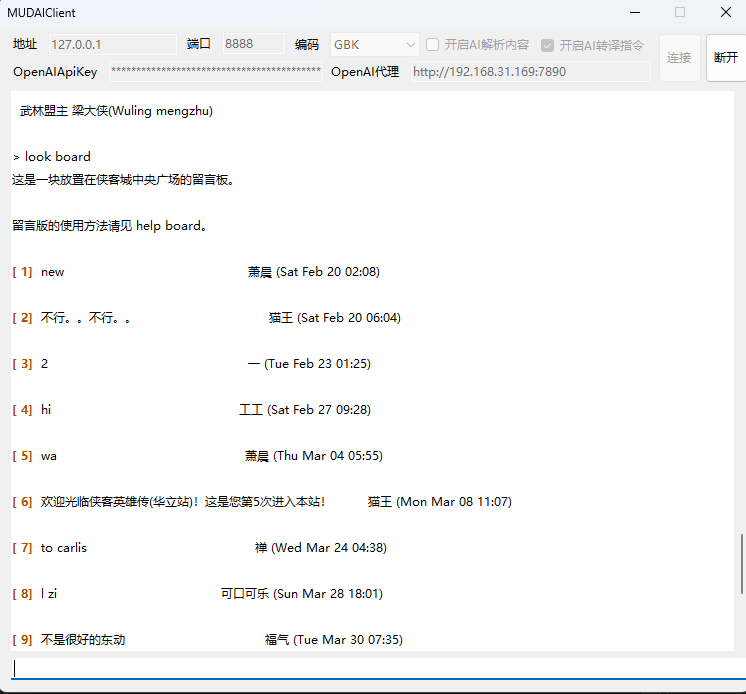
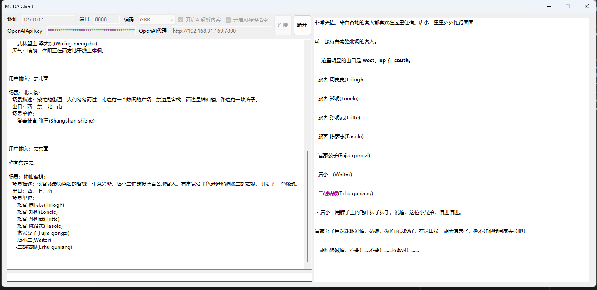
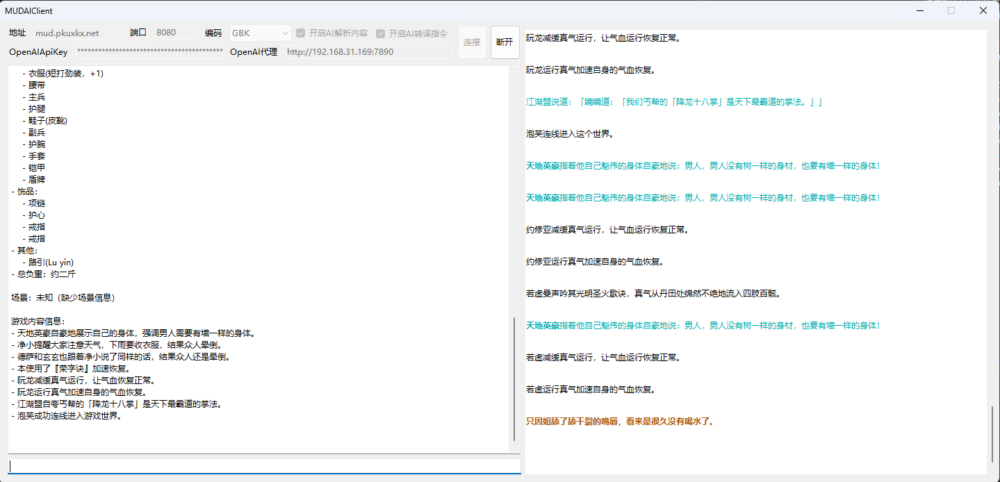
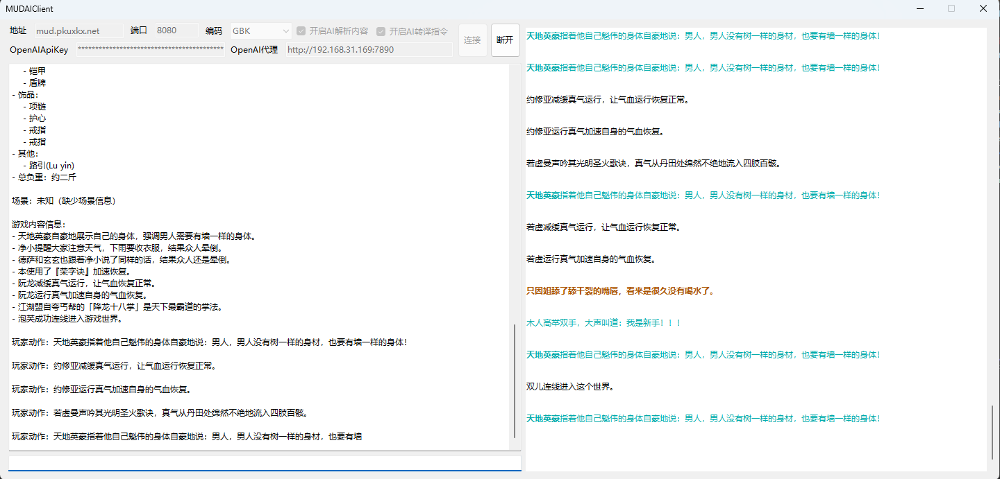

这是一个接入 openai 和 mud 游戏的客户端，可以把玩家输入的内容转换成mud指令，也可以格式化输出mud游戏的内容

This is a client that connects to OpenAI and MUD games, which can convert player input into MUD commands and format and output MUD game content

## Preview

